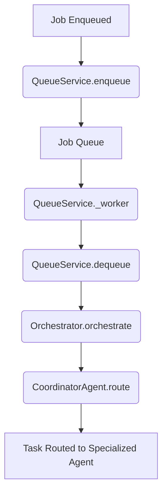

# Architecture

## Overview

This document describes the high-level architecture of the OAL Agent system.

## Components

### Core
- **Orchestrator**: Manages the overall execution flow
- **Pipeline**: Defines analysis pipelines
- **Config**: Configuration management
- **Errors**: Custom error handling

### Agents
- **Coordinator**: Routes tasks to appropriate agents
- **Static Agent**: Performs static analysis
- **Dynamic Agent**: Performs dynamic analysis
- **ML Agent**: Machine learning-based analysis

### Tools
Integration with external security analysis tools.

### Services
Background services for queue management, storage, and results handling.

### LLM
Large Language Model integration for intelligent analysis.

### Security
Security validation, policies, and sandboxing.

### Telemetry
Logging, metrics, and distributed tracing.

## Event Flow

The job lifecycle begins when a job is enqueued, processed by a background worker, and then orchestrated to route tasks to specialized agents for execution.

